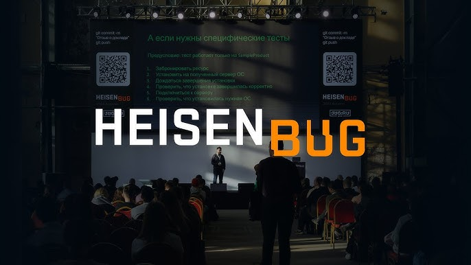
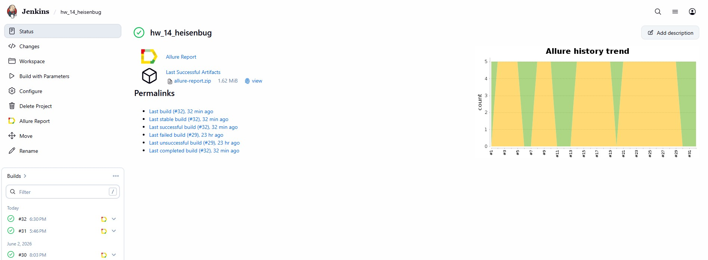
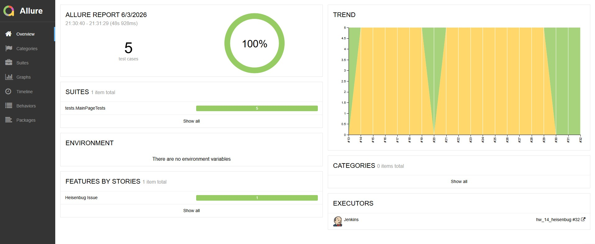
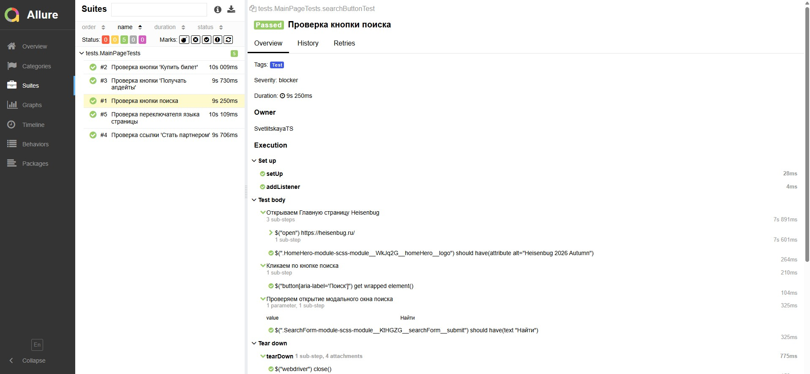
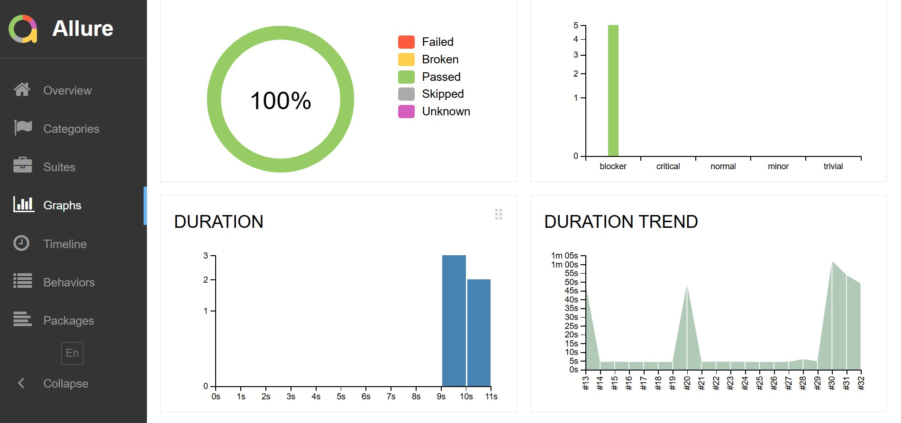
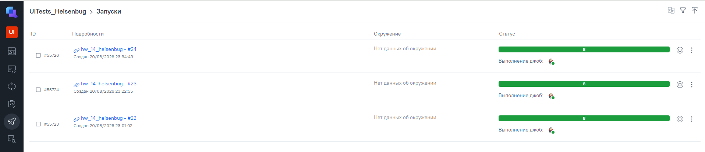
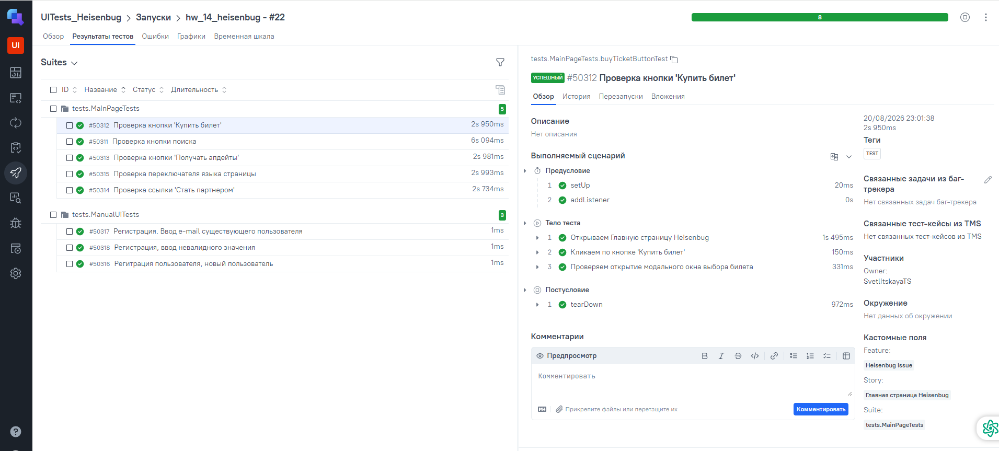
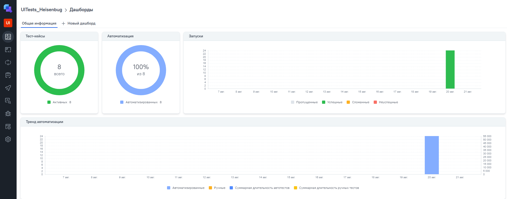
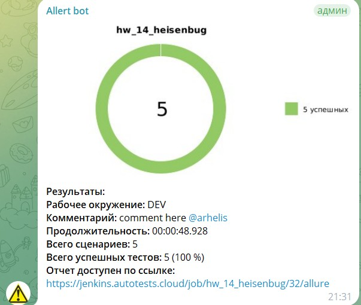
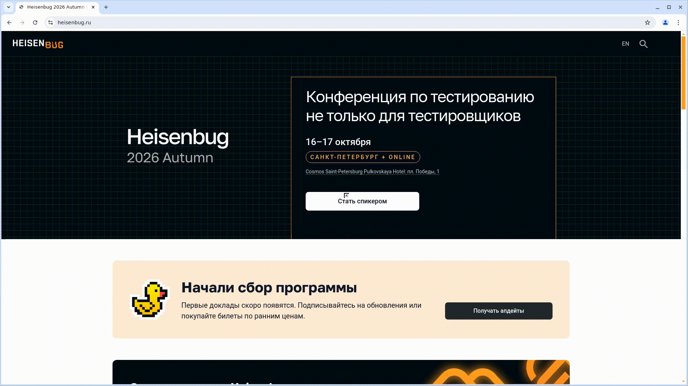

#    Проект по автоматизации тестирования  сайта Heisenbug  

> Проект включает в себя UI-автотесты и ручные тесты для сайта Heisenbug, с использованием современного стека технологий, интеграцией в CI/CD процессы и подключением отчётности.

## 🔗 Ссылки на проект и инфраструктуру
* [Тестируемый сайт](https://heisenbug.ru/)
* [Сборка в Jenkins](https://jenkins.qa.guru/job/hw_14_heisenbug/)
* [Отчет в Allure Report](https://jenkins.qa.guru/job/hw_14_heisenbug/allure/)

## 🛠 Технологический стек

  
  
  
  
  
  
  
  
 
  

* **Язык**: Java 17
* **Фреймворки**: Selenide, JUnit 5
* **Сборка**: Gradle 8.x
* **Отчетность**: Allure Report
* **Test Management System**: Allure TestOps
* **Инфраструктура**: Jenkins, Selenoid
* **Уведомления**: Telegram Bot

---

## :ballot_box_with_check: Реализованные проверки:
<h3>Автоматизированные тесты:</h3>
- Проверка кнопки 'Купить билет'
- Проверка кнопки поиска
- Проверка кнопки 'Получать апдейты'
- Проверка переключателя языка страницы
- Проверка ссылки 'Стать партнером'

<h3>Ручные тесты:</h3>
- Регистрация. Ввод e-mail существующего пользователя
- Регистрация, ввод невалидного значения
- Регитрация пользователя, новый пользователь

##    Сборка в Jenkins

Для запуска сборки необходимо перейти в раздел <code>Buld with Parametrs</code>, выбрать параметры экрана, браузер и нажать кнопку <code>Build</code>.

---
##  Мониторинг и отчетность

После выполнения сборки, в блоке <code>История сборок</code> напротив номера сборки появятся значки <code>Allure Report</code>, при клике на которые откроется страница с сформированным html-отчетом и тестовой документацией соответственно.

 
 
 

---

##  Система управления тест-кейсами TestOps

В TestOps отображаются тест-кейсы, а также запуски со статусом выполнения в реальном времени. Статистика выполнения кейсов отображается на дашбордах, есть возможность настройки кастомных графиков.

 
 
 

---

##  Уведомления в Telegram
Настроена отправка отчётов прохождения тестов, в Telegram-bot.

  

---

###  Видео выполнения тестов
В отчетах Allure для каждого теста прикреплен видео-скриншот прохождения теста.

  
  </img>

---

